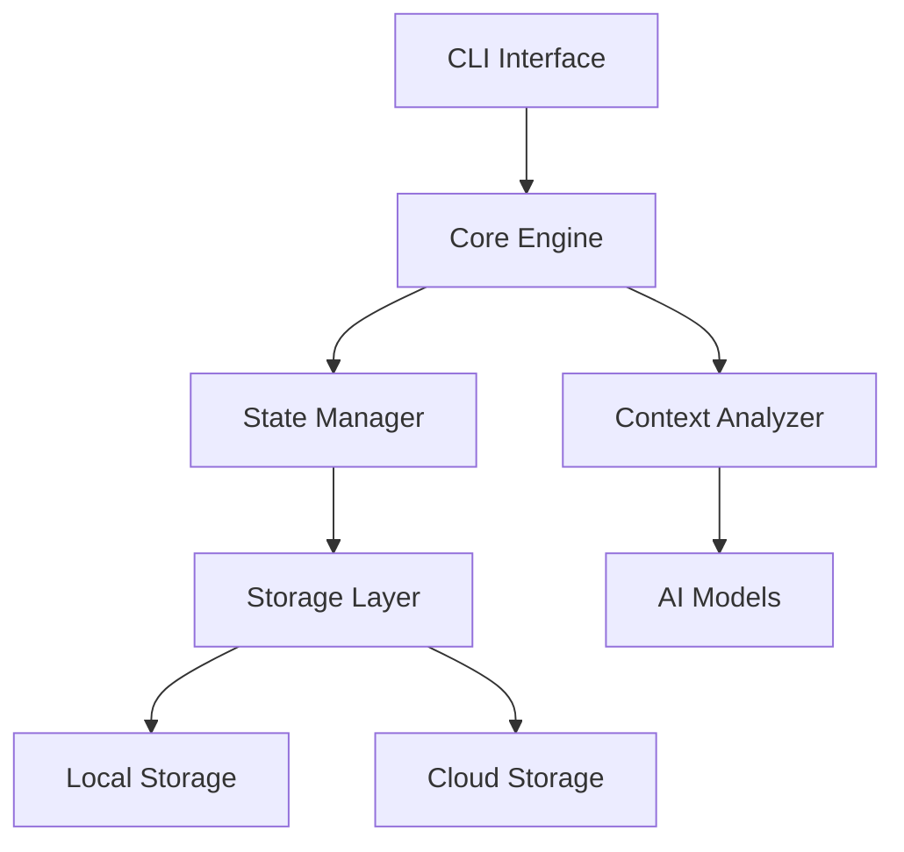

## Overview

Metal is built with a modular architecture that combines Rust for performance-critical components and Node.js for extensibility and developer experience.

## System Components

<CardGroup cols={2}>
  <Card title="Core Engine" icon="engine">
    Rust-based state management and analysis
  </Card>
  <Card title="CLI Interface" icon="terminal">
    Node.js command-line interface
  </Card>
  <Card title="AI Integration" icon="brain">
    Machine learning and context analysis
  </Card>
  <Card title="Storage Layer" icon="database">
    Local and cloud state persistence
  </Card>
</CardGroup>

## Architecture Diagram

## Component Details

1. **Core Engine (Rust)**

   - State management
   - File system operations
   - Performance-critical tasks
   - System integration

2. **CLI Interface (Node.js)**

   - Command processing
   - User interaction
   - Plugin system
   - Developer tools

3. **AI Integration**

   - Context analysis
   - Pattern recognition
   - Task prioritization
   - Learning system

4. **Storage Layer**
   - Local state persistence
   - Cloud synchronization
   - Data encryption
   - Backup management

## Design Decisions

<AccordionGroup>
  <Accordion title="Rust Core">
    - Performance-critical operations - System-level integration - Memory safety - Concurrency
    support
  </Accordion>
  <Accordion title="Node.js CLI">
    - Developer experience - Plugin ecosystem - Cross-platform support - Rapid development
  </Accordion>
</AccordionGroup>

## Data Flow

1. **State Capture**

   - File system monitoring
   - Git state tracking
   - Editor integration
   - Terminal history

2. **Context Analysis**

   - Pattern recognition
   - Priority detection
   - Focus analysis
   - Context mapping

3. **State Management**
   - Local storage
   - Cloud sync
   - Data encryption
   - Version control

## Security

<AccordionGroup>
  <Accordion title="Data Protection">
    - Local-first architecture - End-to-end encryption - Secure storage - Access control
  </Accordion>
  <Accordion title="Privacy">
    - Opt-in analytics - Data minimization - User control - Transparency
  </Accordion>
</AccordionGroup>{' '}
